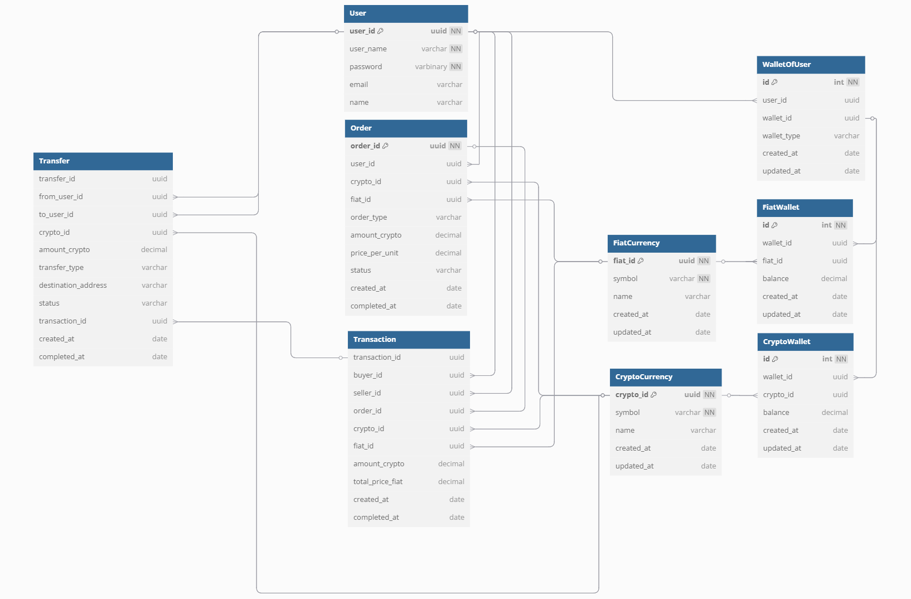

# Crypto Exchange API
## 📦 Tech Stack
- **Backend:** Node.js + Express
- **ORM:** Sequelize (PostgreSQL)
- **Database:** Supabase (PostgreSQL)
- **Docs:** Swagger UI
- **Auth:** (ยังไม่ทำ 😅)

## ⚙️ Installation

### Project and Database Init
```bash
git clone https://github.com/Mongkol30/crypto-exchange.git
cd crypto-exchange
npm install
```
อย่าลืมสร้าง .env ด้วยนะ
```bash
example
DB_HOST=db.xxxxxxxxx.supabase.co
DB_PORT=5432
DB_USERNAME=postgres
DB_PASSWORD=xxxxx
DB_NAME=crypto_exchange
```
### Migrate and Seed Data
```bash
npx sequelize-cli db:migrate
npx sequelize-cli db:seed:all
```

### Start Project
```bash
node app.js
```
### Testing
Swagger: http://localhost:3000/api-docs


## 🧪 Seed Data (สำหรับการทดสอบ)

### Users
| Name       | user_id                                  |
|------------|-------------------------------------------|
| alice123  | 00000000-0000-0000-0000-000000000001     |
| bob456  | 00000000-0000-0000-0000-000000000002     |

### Crypto Currencies
| Symbol | crypto_id                                 |
|--------|--------------------------------------------|
| BTC    | cccccc01-cc01-cc01-cc01-cccccccccc01     |
| ETH    | cccccc02-cc02-cc02-cc02-cccccccccc02   |
| XRP    | cccccc03-cc03-cc03-cc03-cccccccccc03     |
| DOGE    | cccccc04-cc04-cc04-cc04-cccccccccc04     |


### Fiat Currencies
| Symbol | fiat_id                                   |
|--------|--------------------------------------------|
| THB    | ffffff01-ff01-ff01-ff01-ffffffffff01       |
| USD    | ffffff02-ff02-ff02-ff02-ffffffffff02      |





